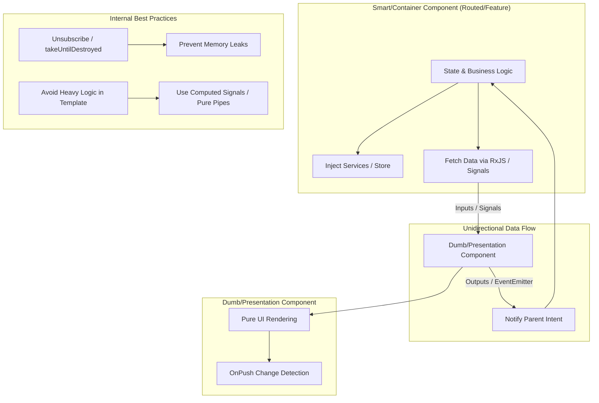
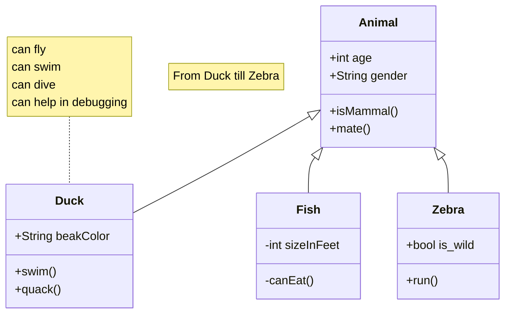
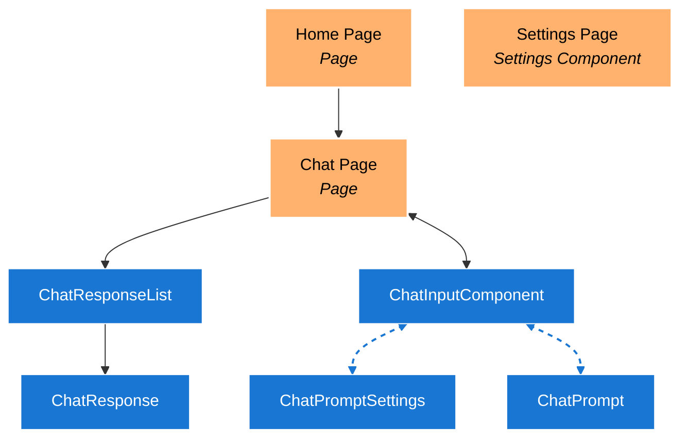

## Component Diagram

Now at demo state, to check various mermaid graph styles. This is not a proper document. Do not refer.

```mermaid
graph TD
    %% Accessibility and Metadata
    %%accTitle: Angular Component Best Practices Architecture
    %%accDescr: Flowchart illustrating the hierarchy and data flow between smart container components and dumb presentation components in Angular.

    subgraph Parent ["Smart/Container Component (Routed/Feature)"]
        A[State & Business Logic] --> B[Inject Services / Store]
        A --> C[Fetch Data via RxJS / Signals]
    end

    subgraph DataFlow ["Unidirectional Data Flow"]
        C -->|Inputs / Signals| D[Dumb/Presentation Component]
        D -->|Outputs / EventEmitter| E[Notify Parent Intent]
        E --> A
    end

    subgraph Presentation ["Dumb/Presentation Component"]
        D --> F[Pure UI Rendering]
        F --> G[OnPush Change Detection]
    end

    subgraph CleanCode ["Internal Best Practices"]
        H[Unsubscribe / takeUntilDestroyed] --> I[Prevent Memory Leaks]
        J[Avoid Heavy Logic in Template] --> K[Use Computed Signals / Pure Pipes]
    end
```

```mermaid
classDiagram
    note "From Duck till Zebra"
    Animal <|-- Duck
    note for Duck "can fly<br>can swim<br>can dive<br>can help in debugging"
    Animal <|-- Fish
    Animal <|-- Zebra
    Animal : +int age
    Animal : +String gender
    Animal: +isMammal()
    Animal: +mate()
    class Duck{
        +String beakColor
        +swim()
        +quack()
    }
    class Fish{
        -int sizeInFeet
        -canEat()
    }
    class Zebra{
        +bool is_wild
        +run()
    }
```

## Page Component Heirarchy

```mermaid
graph TD

  %% Component Nodes
  HomePage[Home Page <br/> <i>Page</i>]
  ChatPage[Chat Page <br/> <i>Page</i>]
  SettingsPage[Settings Page <br/> <i>Settings Component</i>]

  %% Hierarchy Connections
  HomePage --> ChatPage

  ChatPage --> ChatResponseList
  ChatResponseList --> ChatResponse
  ChatPage <--> ChatInputComponent
  ChatInputComponent <--> ChatPromptSettings
  ChatInputComponent <--> ChatPrompt

  %% Data Flow Styling & Indicators
  classDef common fill:#FFB16E,stroke:#fff,stroke-width:2px,color:#fff;
  classDef pages fill:#FFB16E,stroke:#fff,stroke-width:2px,color:#000;
  classDef components fill:#1976d2,stroke:#fff,stroke-width:1px,color:#fff;

  class HomePage,SettingsPage,ChatPage pages;
  class ChatInputComponent,ChatPrompt,ChatResponseList,ChatResponse components;
  class ChatPromptSettings components;

  %% Data flow annotations
  linkStyle 4,5 stroke:#1976d2,stroke-width:2px,stroke-dasharray: 5 5;
```
